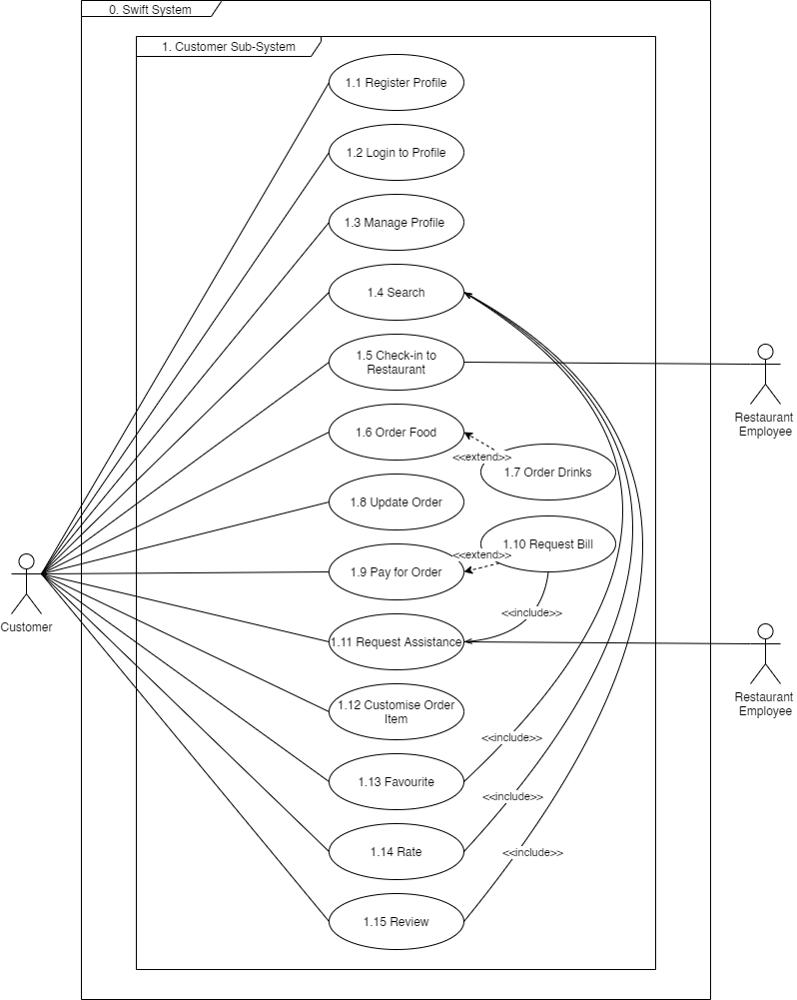
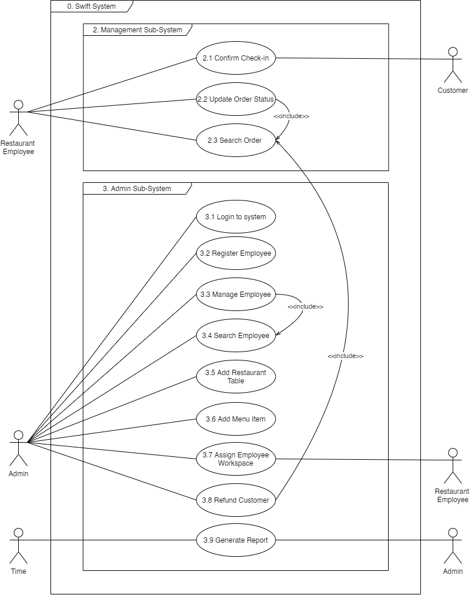

# Use Cases

## Customer Sub-System

### Use Case Diagram - Customer Sub-System

### Customer Sub-System
For Customers, the main value of the application will be derived through the ease of access to
information on the varying available restaurants and their menus as well as the promise of an
amplified restaurant experience that will guarantee them reduced waiting times. To permit for a
more tailored experience for each user, the system will require customers to register an account and
subsequently **login**. They will also be able to **favourite**, **rate** and **review** items from menus for
quicker and more convenient access. To **order** from a restaurant, the customer will first need to
check-in. On the application, this will translate to scanning a unique QR code associated with each
table across the differing restaurants. Once checked-in, the restaurant employees will be notified and
the menu for that restaurant will be displayed. The customer will subsequently be able to browse
the dierent options and **order food** and/or **drinks**. Once an order has been placed, the customer
will be able to cancel or **update** their order within a minute of placing it, after which it will be sent
through to the management system to be processed. Customers will have the option to pay for the
order via an online transaction or by **requesting the bill** from the restaurant employee.
Throughout, a Customer will have the opportunity to **request assistance** which will notify and
inform the restaurant employees of the table which needs to be tended to.

### Use Case Diagram - Management and Admin Sub-System

## Management and Admin Sub-Systems

### Management Sub-System
On the Management side, Restaurant employees will make use of the system to **confirm a customer's check-in** and will **browse** and process the orders that are sent through, **updating their status** as the food items move through the different processing stages.

### Admin Sub-System
There will be one or many admin users associated with each restaurant. As an admin, a user will be
able to **register new employees** at a restaurant, **manage** their information, **add new tables** to a
restaurant and subsequently **assign** these tables to waiters. Furthermore, admin users will be able
to **add new menu items** to a restaurant and possibly **refund** customers. Admin users will have
access to a range of analytics which will report on the number of successfully processed sales, their
revenue, most popular items and the like. Important **reports** will be generated to admin users
periodically.
