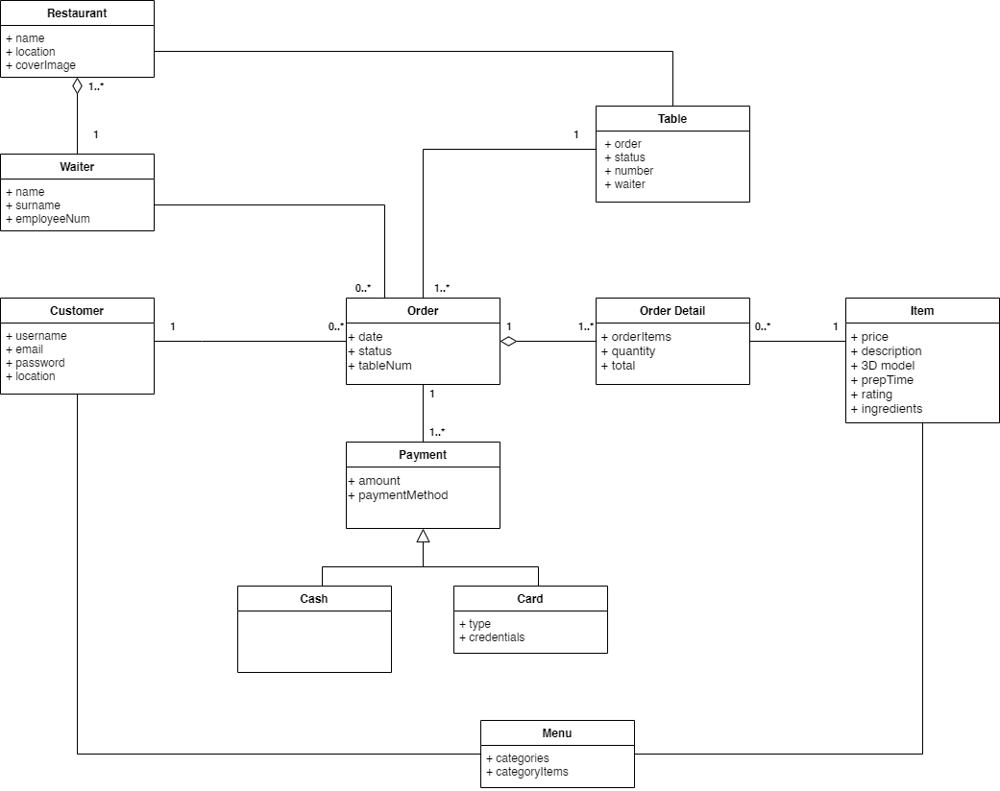

# Domain Model

## Domain Model Diagram

### Domain Model Explanation:
* **Customer and Order:** A Customer will be able to place a number of Orders through the application.
* **Customer and Menu:** A Customer will view the Menu on the application which will contain 3D AR representations of the
items.
* **Order and Payment:** The Customer will be able to make a Payment for the Order through the application. If paying via
Cash, the application will request for a printed receipt from the Waiter.
* **Order and OrderDetail:** The OrderDetail will contain the information of the Order which will be made up of Items of different quantities and order speciation’s.
* **Item and OrderDetail:** An OrderDetail will be made up of many items. The customer will specify the quantity of each item as well specific notes on how it must be prepared.
* **Order and Table:** A Customer will be able to place a number of Orders through the application.
* **Customer and Order:** An Order will be associated with a Table. Waiters will be able to view all the Orders made and the
specific Table with which each one is associated.
* **Waiter and Order:** The Waiter will manage the Orders and update their status.
