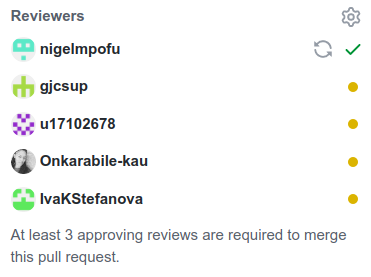
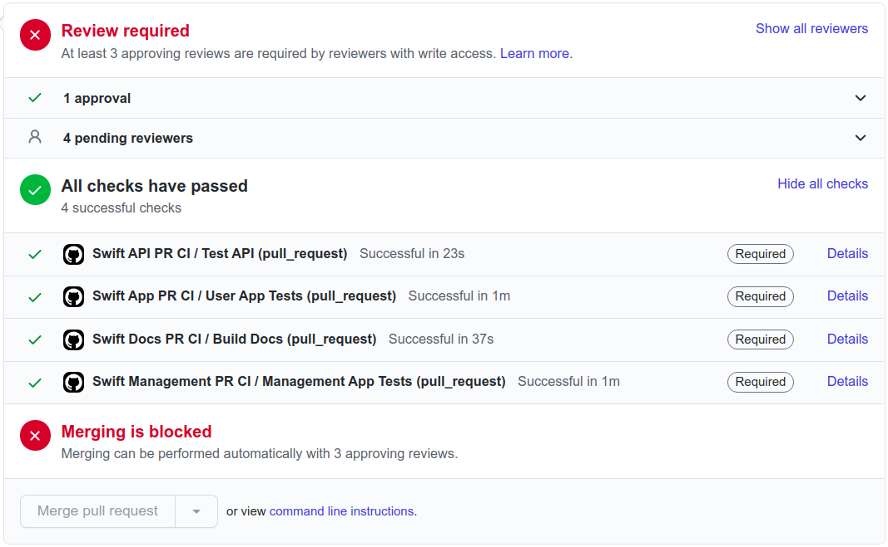
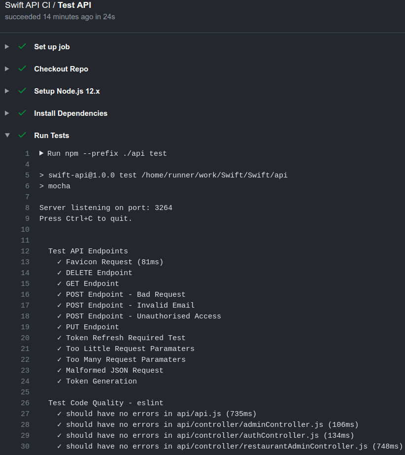
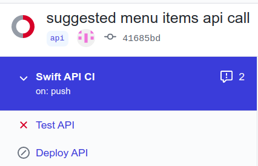
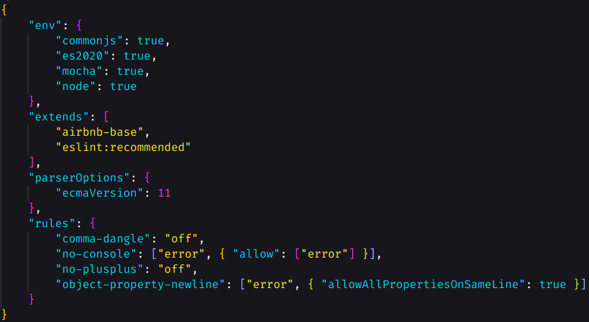
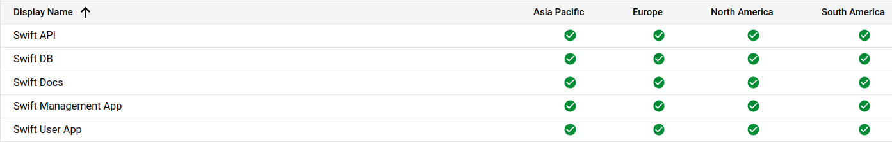
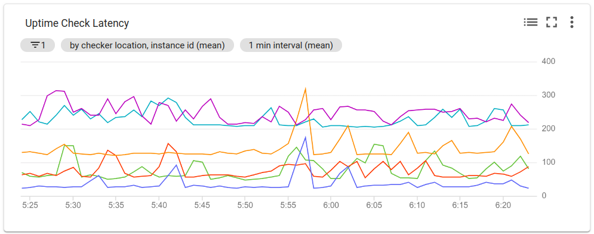
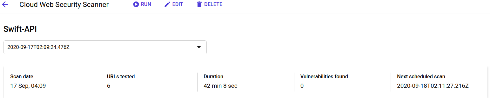
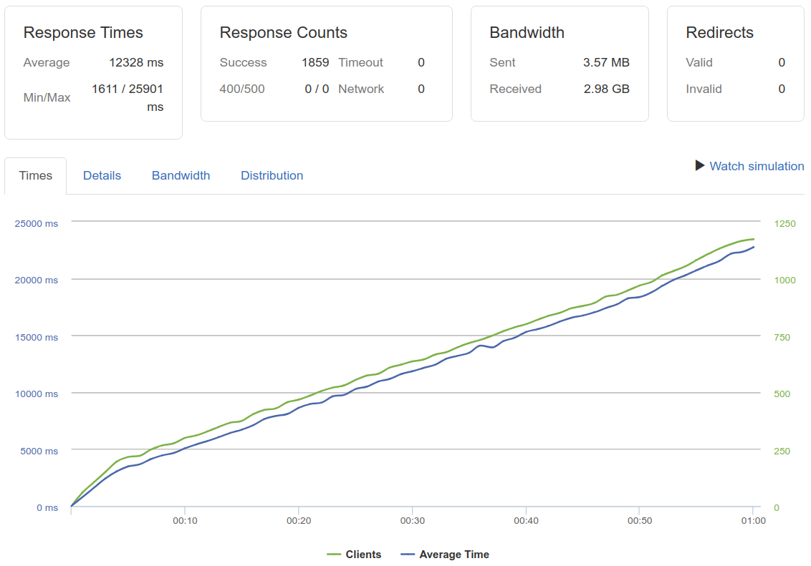
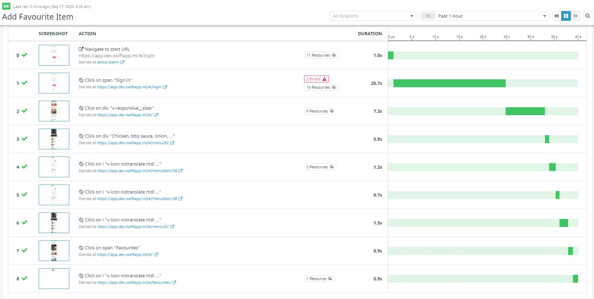

# Testing Policy

## Non-Functional Requirements
We run a range of non-functional requirement tests to ensure our system performs well across different criteria. We primarily used  **[Loader.io](https://loader.io/)**
and **[Datadog's Synthetic Tests](https://www.datadoghq.com/)** to run tests for reliability, scalability, performance, usability and availability.

### 1. Peer Review

The only way to add code to the master branch is by creating a pull request that has to be approved by at least 3 other members before merging is allowed. This ensures that the majority of the team has reviewed the code changes for compliance with the requirements specification as well. This also makes it easier to catch bugs early as more people are actively reviewing the code.

All pull requests are also automatically tested using GitHub Actions (CI/CD) to ensure that all code is working as expected. If any of the tests fail then the merging will be blocked regardless of any approvals from other members.

### 2. Automated Testing
When a commit is made to the Swift GitHub repository a GitHub action is triggered that will automatically run tests on each commit. If deployment is necessary, the all tests are required to pass first. Through the use of GitHub secrets all sensitive credentials, necessary for deployment on the Swift production environment, are stored in an encrypted location away from the public repository that is available to the public where they are easily accessible by the CI/CD system in order to carry out the deployment procedure.

The above screenshot shows the testing logs from one of the commits.

In the event that a test fails. The deployment step is aborted to avoid breaking the production environment which could negatively impact availability.

### 3. Code Quality - ESLint
Bad code quality may not only be unreadable but it could also easily lead to the introduction of bugs. As a result, ESLint is used to test the code quality and enforce coding standards. Bad code will fail any automated test therefore the developer are encourage to follow strict coding standard. The Airbnb configuration (with minor tweaks) for ESLint is used.

### 4. Uptime Checks
To ensure good availability, automated uptime checks are performed every minute to ensure that any issues in the production environment are caught as soon as possible and can be rectified. Swift uptime check are performed using the uptime monitor on the Google Cloud platform. This was chosen as it will integrate well with all other Swift systems as they are already being hosted on the Google Cloud Platform.

All uptime checks are performed from various geographic locations to ensure that Swift is accessible from anywhere without any problems.

The latency of all uptime check is also monitored to ensure that the system remains responsive to ensure a good user experience. Any sudden lag spikes are automatically reported.

### 5. Vulnerability Testing
The Swift API is thoroughly tested daily for vulnerabilities using the Google Cloud Web Security Scanner to ensure that any new vulnerabilities are caught as soon as possible so they are quickly patched before they can be exploited.

### 6. Load Testing for Reliability, Scalability and Performance
The Swift API is load tested once a week to ensure that the scalability requirement is met by checking if the API is able to handle a sudden spike in traffic which is expected for the system as most restaurants usually receive an influx of customers at specific moments such as dinner in the evening. Loader.io is used for the load testing as shown below.

### 7. Usability and Availability Testing
For the usability and availability testing, we use **[Datadog's Synthetic Tests](https://www.datadoghq.com/)** which simulate the user's view of the application.
We run API tests which monitor uptime and availability, as well as browser tests which are **End to End Integration Tests** that monitor the key use cases for our application. They
create a step by step recording of each use case to ensure that the correct data is retrieved and that all the components of the application are loaded. All of the tests are scheduled and run on a continuous basis once a day.

